# UML Class Diagram - Asset Management System

```mermaid
classDiagram
    class User {
        +int id
        +string name
        +string email
        +string password
        +string role
        +boolean is_active
        +string photo_path
        +datetime email_verified_at
        +string remember_token
        +datetime created_at
        +datetime updated_at
        --
        +index(Request) User[]
        +create() View
        +store(Request) Redirect
        +edit(User) View
        +update(Request, User) Redirect
        +destroy(User) Redirect
        +authenticate(Credentials) Auth
        +logout() Redirect
        +updateProfile(Request) Redirect
        +changePassword(Request) Redirect
        +uploadPhoto(Request) Redirect
    }

    class Asset {
        +int id
        +string asset_code
        +string name
        +string category
        +string brand
        +string model
        +string serial_number
        +string location
        +string status
        +string condition
        +date purchase_date
        +decimal purchase_price
        +text notes
        +string qr_payload
        +string qr_path
        +int created_by
        +int updated_by
        +datetime created_at
        +datetime updated_at
        --
        +index(Request) Asset[]
        +create() View
        +store(Request, QrCodeService) Redirect
        +edit(Asset) View
        +update(Request, Asset, QrCodeService) Redirect
        +destroy(Asset, QrCodeService) Redirect
        +show(Asset) View
        +showByCode(string) View
        +printQr(Asset) View
        +printAllQr(Request) View
        +export(Request, string) Download
        +exportSelected(Request) Download
        +importPage() View
        +importStore(Request) Redirect
        +template() Download
        +search(Request) Asset[]
        +filterBy(Request) Asset[]
        +generateQrCode(Asset) QrData
        +transfers() AssetTransfer[]
    }

    class AssetTransfer {
        +int id
        +int asset_id
        +string from_location
        +string to_location
        +datetime transfer_date
        +int moved_by
        +int approved_by
        +text note
        +datetime created_at
        +datetime updated_at
        --
        +index() AssetTransfer[]
        +create() View
        +store(Request) Redirect/Json
        +printAll() View
        +filterByDate(Request) AssetTransfer[]
        +filterByAsset(Request) AssetTransfer[]
        +approveTransfer(AssetTransfer) Redirect
        +rejectTransfer(AssetTransfer) Redirect
        +asset() Asset
        +mover() User
        +approver() User
    }

    Asset "1" -- "*" AssetTransfer : has
    AssetTransfer "*" -- "1" Asset : belongs to
    User "1" -- "*" AssetTransfer : moves (moved_by)
    User "1" -- "*" AssetTransfer : approves (approved_by)
    AssetTransfer "*" -- "1" User : moved by
    AssetTransfer "*" -- "1" User : approved by
```

## Available Functions by Class

### User Model Functions
**CRUD Operations:**
- `index(Request)` - Display paginated list of users with search functionality
- `create()` - Show user creation form
- `store(Request)` - Create new user with validation
- `edit(User)` - Show user edit form
- `update(Request, User)` - Update user data including photo upload
- `destroy(User)` - Delete user (with self-deletion protection)

**Authentication Functions:**
- `authenticate(Credentials)` - Login validation and session creation
- `logout()` - Session termination
- `updateProfile(Request)` - Update user profile information
- `changePassword(Request)` - Change user password
- `uploadPhoto(Request)` - Upload and update profile photo

### Asset Model Functions
**CRUD Operations:**
- `index(Request)` - Display paginated assets with search, filter, and sorting
- `create()` - Show asset creation form
- `store(Request, QrCodeService)` - Create asset with automatic QR generation
- `edit(Asset)` - Show asset edit form
- `update(Request, Asset, QrCodeService)` - Update asset and regenerate QR
- `destroy(Asset, QrCodeService)` - Delete asset and remove QR file

**Display Functions:**
- `show(Asset)` - Display asset details
- `showByCode(string)` - Display asset by QR code (public access)
- `printQr(Asset)` - Generate printable QR code for single asset
- `printAllQr(Request)` - Generate printable QR codes for filtered assets

**Import/Export Functions:**
- `export(Request, string)` - Export assets to Excel (xlsx), CSV, or PDF
- `exportSelected(Request)` - Export selected assets to various formats
- `importPage()` - Display import form page
- `importStore(Request)` - Import assets from Excel/CSV file
- `template()` - Download Excel template for import

**Utility Functions:**
- `search(Request)` - Search assets by code, name, serial, or location
- `filterBy(Request)` - Filter by category, location, or sort options
- `generateQrCode(Asset)` - Generate QR code with asset code
- `transfers()` - Get related transfer records

### AssetTransfer Model Functions
**CRUD Operations:**
- `index()` - Display paginated transfer history
- `create()` - Show transfer creation form
- `store(Request)` - Create transfer record (supports AJAX/QR Scanner)
- `printAll()` - Generate printable transfer report

**Filtering Functions:**
- `filterByDate(Request)` - Filter transfers by date range
- `filterByAsset(Request)` - Filter transfers by specific asset

**Approval Functions:**
- `approveTransfer(AssetTransfer)` - Approve pending transfer
- `rejectTransfer(AssetTransfer)` - Reject pending transfer

**Relationship Functions:**
- `asset()` - Get related asset
- `mover()` - Get user who moved the asset
- `approver()` - Get user who approved the transfer

## Relationship Summary

1. **Asset ↔ AssetTransfer**: One-to-many relationship
   - One asset can have multiple transfer records
   - Each transfer record belongs to exactly one asset

2. **User ↔ AssetTransfer**: One-to-many relationships (two separate connections)
   - One user can move multiple assets (as mover)
   - One user can approve multiple transfers (as approver)
   - Each transfer has exactly one mover and one approver

## Notes
- The `created_by` and `updated_by` fields in Asset model likely reference User IDs but don't have explicit relationship methods defined
- The system supports tracking asset movement history with approval workflow
- Users can have different roles (admin, regular user, etc.) for permission management
